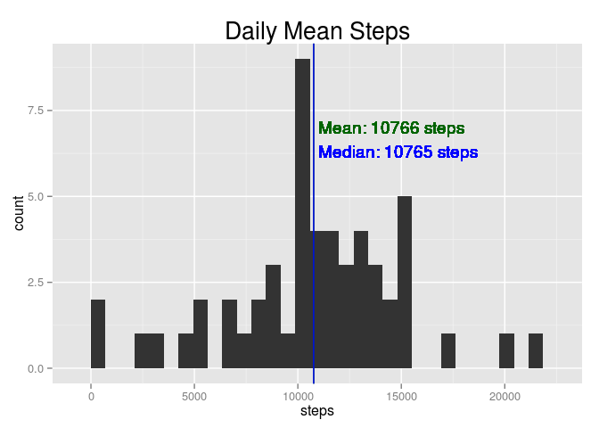
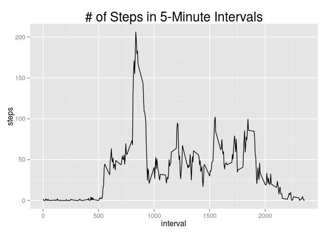
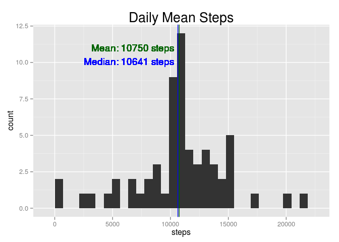
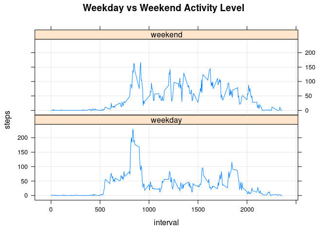

# Reproducible Research: Peer Assessment 1


## Loading and preprocessing the data


```r
setwd('~/Sandbox/ReproducibleResearch/RepData_PeerAssessment1')

df <- read.csv('activity.csv', header=T, stringsAsFactors=F)

df$dt <- as.POSIXct(strptime(paste(df$date, sprintf("%04d", df$interval)), "%Y-%m-%d %H%M"))
df$wd <- as.factor(weekdays(df$dt))
```

## What is mean total number of steps taken per day?


```r
library(ggplot2)

df1 <- aggregate(steps ~ date, df, sum, na.action=na.omit)
dailyMeanSteps <- mean(df1$steps)
dailyMedianSteps <- median(df1$steps)

ggplot(df1, aes(x=steps)) + 
    ggtitle("Daily Mean Steps") +
    geom_histogram() +
    geom_vline(aes(xintercept=dailyMeanSteps), color="darkgreen", linetype=1) +
    geom_vline(aes(xintercept=dailyMedianSteps), color="blue", linetype=1) +
    geom_text(aes(x=dailyMeanSteps, y=7, label=sprintf(" Mean: %.0f steps", dailyMeanSteps)), color="darkgreen", hjust=0) +    
    geom_text(aes(x=dailyMeanSteps, y=7, label=sprintf("\n\n Median: %d steps", dailyMedianSteps)), color="blue", hjust=0) +
    theme(plot.title=element_text(size=20))
```

 

## What is the average daily activity pattern?


```r
df2 <- aggregate(steps ~ interval, df, mean)
ggplot(df2, aes(x=interval, y=steps)) + 
    ggtitle("# of Steps in 5-Minute Intervals") +
    geom_line() +
    theme(plot.title=element_text(size=20))
```

 

```r
maxInterval <- as.list(df2[which.max(df2$steps), ])
sprintf("Max interval: %02d:%02d", floor(maxInterval$interval/100), maxInterval$interval%%100)
```

```
## [1] "Max interval: 08:35"
```

```r
sprintf("Max # of steps: %0.f", maxInterval$steps)
```

```
## [1] "Max # of steps: 206"
```

## Imputing missing values


```r
sprintf("# of rows with missing steps value: %d", sum(is.na(df$steps)))
```

```
## [1] "# of rows with missing steps value: 2304"
```

Here we use the average # of steps in each 5-minute interval to fill in the NA values.  The average # of steps is rounded to the nearest integer:


```r
df3 <- df
naRows <- is.na(df3$steps)
df3[naRows,]$steps <- as.integer(df2[match(df3[naRows,]$interval, df2$interval),]$steps)
```

Plotting the new histogram based on updated data frame, with NA rows filled in:


```r
df4 <- aggregate(steps ~ date, df3, sum, na.action=na.omit)
dailyMeanSteps2 <- mean(df4$steps)
dailyMedianSteps2 <- median(df4$steps)

ggplot(df4, aes(x=steps)) + 
    ggtitle("Daily Mean Steps") +
    geom_histogram() +
    geom_vline(aes(xintercept=dailyMeanSteps2), color="darkgreen", linetype=1) +
    geom_vline(aes(xintercept=dailyMedianSteps2), color="blue", linetype=1) +
    geom_text(aes(x=dailyMeanSteps2, y=11, label=sprintf("Mean: %.0f steps  ", dailyMeanSteps2)), color="darkgreen", hjust=1) +    
    geom_text(aes(x=dailyMeanSteps2, y=11, label=sprintf("\n\nMedian: %d steps  ", dailyMedianSteps2)), color="blue", hjust=1) +
    theme(plot.title=element_text(size=20))
```

 

The new mean and median is lower than the original plot, which suggests that the time intervals with NA values are those intervals with lower than average # of steps.

## Are there differences in activity patterns between weekdays and weekends?


```r
df3$dayOfWeek <- ifelse(df3$wd=='Saturday'|df3$wd=='Sunday', 'weekend', 'weekday')
df3$dayOfWeek <- as.factor(df3$dayOfWeek)

df5 <- aggregate(steps ~ interval + dayOfWeek, df3, mean)

library(lattice)
attach(df5)
xyplot(steps ~ interval | dayOfWeek, type='l', grid=T, layout=c(1,2), main="Weekday vs Weekend Activity Level")
```

 
